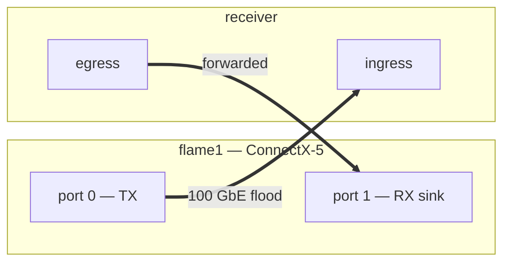
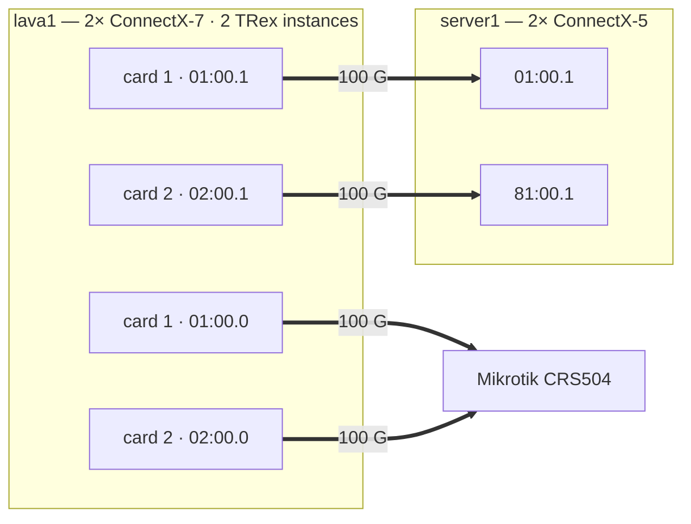

# TRex Line-Rate Traffic Generation — Lab Reports

Detailed [TRex](https://trex-tgn.cisco.com/) configurations, host tuning, and
measured peak rates for generating **64-byte line-rate traffic** on commodity
hardware. Two generators are documented:

| Generator | CPU | NIC | Peak (64 B) |
|-----------|-----|-----|-------------|
| **[flame1](flame1.md)** | AMD Ryzen 7 5800X (8C/16T) | ConnectX-5 Ex, dual-port 100 G | **142 Mpps** single-port (100 % line rate) |
| **[lava1](lava1.md)**   | AMD Ryzen 9 9950X (16C/32T, Zen 5) | **2× ConnectX-7** (both ports each → server1 + Mikrotik) | **~282 Mpps** at 2×100 G line rate · **~505 Mpps** total (4 ports) · **400 G @ 1500 B** |

## What "line rate" means at 64 B

Our builders emit **64 B before FCS** → **68 B on the wire**, so 100 GbE line rate
is **142.05 Mpps** (not 148.8, which needs 64 B *including* FCS). See
[METHODOLOGY.md](METHODOLOGY.md#frame-size-convention) for the arithmetic.

## Test topology

Generator and receiver are cabled **back-to-back** (no switch). Two setups.

**1. flame1 — 100 G, single-port.** One port floods; the other is an RX sink for what
the receiver forwards back (the 64 B line-rate case).



**2. lava1 — 2× ConnectX-7, up to 4×100 G (current).** Two cards, both ports each. The
`.1` ports flood server1's 2× ConnectX-5 (2×100 G at line rate); the `.0` ports flood a
Mikrotik CRS504. Two TRex instances (one per card) drive all four ports → **~505 Mpps
total** (2×100 G line rate = 282 Mpps with cores to spare).



## Key findings

- A single fast core does ~35 Mpps of TX; **~4–5 cores per 100 G port** reaches line rate.
- **Clock beats core count** — the 5.7 GHz Ryzen with 14 threads hits line rate where a
  2.1 GHz dual-Xeon with 36 threads tops out ~135 Mpps.
- **One dual-port NIC never doubles at 64 B.** Both ports share one packet engine:
  ConnectX-5 tops ~197 Mpps aggregate, ConnectX-7 ~278 Mpps — regardless of host.
- **One TRex instance cannot dedicate cores per port.** With both ports in one instance
  every core services two TX rings and the aggregate stalls near **185 Mpps**. The fix is
  **two TRex instances**, each owning one real port with disjoint cores — see
  [lava1.md](lava1.md#dual-port-278-mpps--two-trex-instances).
- **1500 B lifts the dual-port cap to the full 400 G.** The ~278 Mpps ceiling is a 64 B
  *packet-engine* limit; at 1500 B (low pps) lava's two instances deliver the full
  2×200 G = **400 G** — bandwidth, not the engine — see
  [lava1.md](lava1.md#400-g-at-1500-b--dual-port-against-a-200-g-peer).
- **Two separate cards reach line rate where one dual-port card can't.** Two CX-7 cards
  (two engines) do **~282 Mpps at 64 B** (~100% of 2×100 G), each card at its full
  141 Mpps, vs one dual-port card's shared-engine 278 (98%). Requires **flow control
  OFF** — see [lava1.md](lava1.md#two-cards--200-g-at-true-line-rate-2-connectx-7).
- **Minimal cores, then spend the spare on more ports.** 2×100 G line rate needs only
  6 workers/instance (12 of 16 cores). Driving *both* ports of each card (server1 + a
  Mikrotik switch — still 2 instances, as mlx5 caps at one process per card) uses all
  16 cores for **~505 Mpps total** at 64 B (~355 Gbps), CPU-bound.

## Repository layout

**Reports & tuning**
- [`flame1.md`](flame1.md) — Ryzen 5800X + ConnectX-5, single-port 100 G line rate.
- [`lava1.md`](lava1.md) — Ryzen 9950X + ConnectX-7, single- and dual-port; the split-core two-instance setup for ~278 Mpps.
- [`tuning-checklist.md`](tuning-checklist.md) — host + NIC tweaks and BIOS settings common to both.
- [`METHODOLOGY.md`](METHODOLOGY.md) — what we measure, the 64 B frame convention, how a run is taken, determinism.
- [`results.csv`](results.csv) — all measured rates in machine-readable form.

**TRex platform configs** — the ready-to-use `/etc/trex_cfg.yaml` for each machine is
shown inline in [`flame1.md`](flame1.md) and [`lava1.md`](lava1.md) (single- and dual-instance).

## Quick start

```bash
# 1. install a platform config — copy the YAML from lava1.md / flame1.md
#    to /etc/trex_cfg.yaml
# 2. host/NIC tuning — see tuning-checklist.md
# 3. start TRex
cd /opt/trex && ./t-rex-64 -i --iom 0 --no-scapy-server --no-ofed-check -c 30
# 4. drive a 64-byte profile at line rate from your TRex STL client
```
